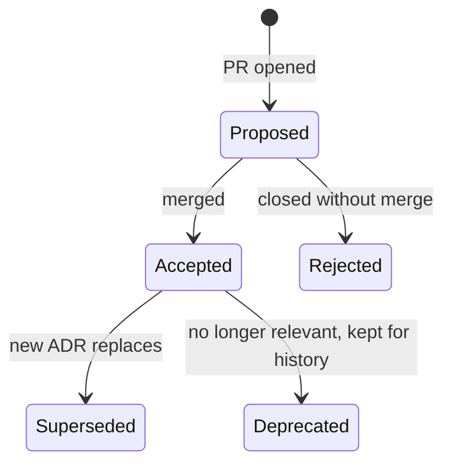

# Architecture Decision Records (ADRs)

> **Maintainer:** Tech leads
> **Purpose:** Capture the *why* behind every significant technical decision.

---

## What is an ADR?

An **Architecture Decision Record** documents a significant choice — why it was made, what we considered, and what we agreed to live with. ADRs are:

- **Short** — one page is the target. If it's longer, the decision is too broad.
- **Immutable** — once accepted, never edited. Superseded by a new ADR.
- **Honest** — record what we rejected and why. "Considered alternatives" is the most valuable section.
- **Dated** — context drifts; you want to know *when* a call was made.

We follow the Michael Nygard format. Template: [`template.md`](./template.md).

---

## When to write an ADR

Write an ADR when you:
- Pick a major library, framework, or pattern.
- Introduce a cross-cutting convention (auth, error format, caching).
- Change a previous ADR.
- Decide *not* to do something the team expected you would.

You **don't** need an ADR for: routine library upgrades, bug fixes, or anything reversible in an afternoon.

---

## Lifecycle

When an ADR is superseded, add a `Superseded-By: ADR-N` header to the old one. Never delete.

---

## Index

| # | Title | Status | Date |
|---|---|---|---|
| [0001](./0001-record-architecture-decisions.md) | Record architecture decisions | Accepted | [DATE] |
| [0002](./0002-modular-monolith.md) | Modular monolith over microservices (for now) | Accepted | [DATE] |
| [0003](./0003-nestjs-backend.md) | NestJS for the backend | Accepted | [DATE] |
| [0004](./0004-nextjs-frontend.md) | Next.js (App Router) for the frontend | Accepted | [DATE] |
| [0005](./0005-postgresql-prisma.md) | PostgreSQL + Prisma for the data layer | Accepted | [DATE] |
| [0006](./0006-monorepo-pnpm.md) | Monorepo with pnpm + Turborepo | Accepted | [DATE] |
| [0007](./0007-shared-zod-contracts.md) | Zod schemas as the single source of truth for contracts | Accepted | [DATE] |
| [0008](./0008-api-versioning-uri.md) | URI-based API versioning | Accepted | [DATE] |

To add a new ADR: copy `template.md` to `NNNN-short-name.md`, fill it in, open a PR.
