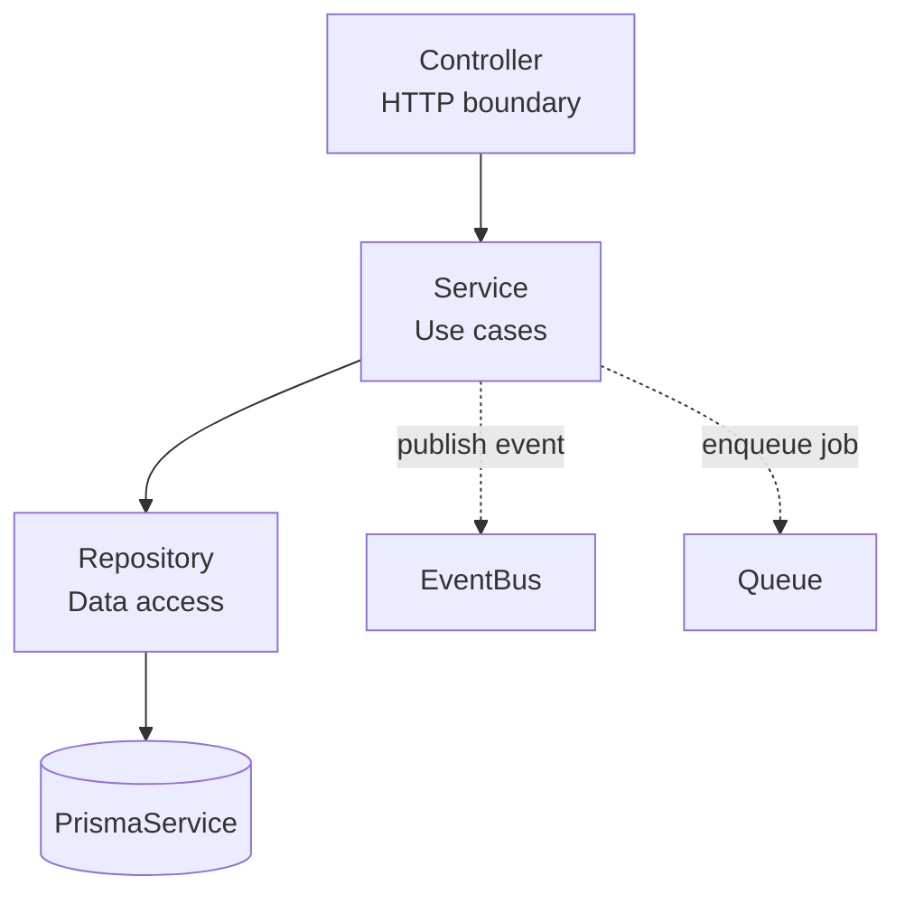

# Backend Architecture (NestJS)

> **Maintainer:** Backend Team
> **Last reviewed:** [DATE]
> **Status:** Living document

---

## 1. Goals

1. **Maintainability** — any engineer can find any feature within 30 seconds.
2. **Testability** — every layer is unit-testable in isolation.
3. **Performance** — predictable hot paths, no N+1 queries, no unnecessary serialization.
4. **Type safety** — no `any`, contracts validated at every boundary.
5. **Scalability** — modules can be extracted into services without rewrites.

---

## 2. Module Structure

Each feature is a **NestJS module**. Modules are isolated by default and expose a narrow public surface.

```
apps/api/src/
├── main.ts                    # Bootstrap
├── app.module.ts              # Root module (wires feature modules)
│
├── modules/
│   ├── auth/
│   │   ├── auth.module.ts
│   │   ├── auth.controller.ts          # HTTP boundary
│   │   ├── auth.service.ts             # Use cases / orchestration
│   │   ├── auth.repository.ts          # Prisma access (optional layer)
│   │   ├── guards/
│   │   ├── strategies/
│   │   ├── dto/                         # Zod schemas + types
│   │   └── auth.service.spec.ts
│   │
│   ├── users/
│   ├── billing/
│   ├── notifications/
│   └── ...
│
├── common/                    # Cross-cutting, NO business logic
│   ├── decorators/            # @CurrentUser, @Public, @Roles
│   ├── filters/               # HttpExceptionFilter
│   ├── guards/                # AuthGuard, RolesGuard
│   ├── interceptors/          # LoggingInterceptor, TransformInterceptor
│   ├── pipes/                 # ZodValidationPipe
│   └── middleware/            # RequestId, RequestLogger
│
├── config/
│   ├── config.module.ts
│   ├── config.schema.ts       # Zod schema for env vars
│   └── config.service.ts      # Typed access
│
├── infrastructure/
│   ├── prisma/                # PrismaService (DI-friendly client)
│   ├── redis/
│   ├── queue/                 # BullMQ setup
│   ├── storage/               # S3 client
│   └── observability/         # Tracer, logger, metrics setup
│
└── health/                    # /health, /ready, /metrics
```

### Module conventions

A feature module **must** contain only:
- `*.module.ts` — declares providers, controllers, imports/exports.
- `*.controller.ts` — HTTP layer. Thin. Validates input, calls service, shapes response.
- `*.service.ts` — Business logic. Plain TS classes, framework-light.
- `*.repository.ts` (optional) — Prisma access if queries are non-trivial.
- `dto/` — Zod schemas + inferred TS types. Imported from `@[project]/contracts`.
- `*.spec.ts` — Co-located unit tests.
- `*.e2e-spec.ts` (in `apps/api/test/`) — Integration / E2E.

A feature module **must not**:
- Import another module's service directly. Use the public module export.
- Reach into another module's `prisma` queries.
- Leak Prisma types past the repository.

---

## 3. Layering



| Layer | Responsibility | Knows about |
|---|---|---|
| Controller | Parse, validate, return DTO. No business logic. | Zod schemas, Service interface |
| Service | Business rules, transactions, orchestration | Repositories, other services (via DI), event bus, queue |
| Repository | Data access via Prisma. Returns domain objects. | Prisma client, mappers |
| Infrastructure | Concrete adapters (Redis, S3, providers) | External SDKs |

### Why a repository layer?
We don't enforce it everywhere. Add it when:
- The module has > 5 distinct queries.
- Queries need to be reused across services.
- You want to mock data access in service unit tests.

For simple modules, the service can call Prisma directly. Pragmatism > purity.

---

## 4. Dependency Injection Patterns

### 4.1 Constructor injection only

```typescript
@Injectable()
export class BillingService {
  constructor(
    private readonly prisma: PrismaService,
    private readonly stripe: StripeService,
    private readonly events: EventBus,
    @Inject(LOGGER) private readonly logger: Logger,
  ) {}
}
```

No property injection. No `forwardRef` unless mathematically required (and then add a comment explaining why the circular dependency exists).

### 4.2 Tokens for interfaces

```typescript
// payment.port.ts
export const PAYMENT_PROVIDER = Symbol('PAYMENT_PROVIDER');
export interface PaymentProvider {
  charge(amount: number, customerId: string): Promise<PaymentResult>;
}

// billing.module.ts
providers: [
  { provide: PAYMENT_PROVIDER, useClass: StripePaymentProvider },
];
```

This makes the provider swappable (e.g., for testing with a fake, or swapping Stripe → another processor).

---

## 5. Configuration

All config flows through a **typed, validated** ConfigService.

```typescript
// config.schema.ts
import { z } from 'zod';

export const ConfigSchema = z.object({
  NODE_ENV: z.enum(['development', 'test', 'staging', 'production']),
  PORT: z.coerce.number().default(3001),
  DATABASE_URL: z.string().url(),
  REDIS_URL: z.string().url(),
  JWT_SECRET: z.string().min(32),
  JWT_ACCESS_TTL: z.string().default('15m'),
  // ...
});

export type AppConfig = z.infer<typeof ConfigSchema>;
```

The app **fails to start** if env vars are missing or invalid. No defensive `??` scattered through the code.

---

## 6. Validation: Zod Pipe

Single source of truth for shapes lives in `packages/contracts/`. Backend consumes them via a pipe:

```typescript
@Post()
async create(
  @Body(new ZodValidationPipe(CreateUserSchema)) dto: CreateUserDto,
) {
  return this.usersService.create(dto);
}
```

- DTOs are **types**, never classes — Zod schemas + `z.infer<>`.
- Errors from validation use the standard error envelope.
- Same schema runs on the frontend form.

---

## 7. Error Handling

### 7.1 Domain errors

Define narrow error types per module:

```typescript
export class UserNotFoundError extends DomainError {
  readonly code = 'USER_NOT_FOUND';
  readonly httpStatus = 404;
  constructor(userId: string) { super(`User ${userId} not found`); }
}
```

A global `HttpExceptionFilter` maps these to the standard envelope.

### 7.2 Standard error envelope

```json
{
  "error": {
    "code": "USER_NOT_FOUND",
    "message": "Human-readable message",
    "requestId": "req_abc123",
    "details": { "userId": "usr_xyz" }
  }
}
```

See [API Design](../conventions/api-design.md#error-format).

### 7.3 Unhandled errors

→ Logged with full context → Sentry → returns generic `INTERNAL_ERROR` to the client. Never leak stack traces past the filter.

---

## 8. Transactions

**Rule:** A single HTTP request maps to **at most one** database transaction.

```typescript
async transferCredits(fromId: string, toId: string, amount: number) {
  return this.prisma.$transaction(async (tx) => {
    await this.accountsRepo.debit(tx, fromId, amount);
    await this.accountsRepo.credit(tx, toId, amount);
    await this.ledgerRepo.record(tx, { fromId, toId, amount });
  });
}
```

- Repositories accept an optional `tx` parameter (`Prisma.TransactionClient`).
- Default `prisma` client is used outside transactions.
- Long-running work (emails, webhooks) goes to the queue **after** the transaction commits.

---

## 9. Async Work (BullMQ)

Anything that takes more than ~100ms and isn't strictly required for the response → queue it.

```typescript
@Injectable()
export class UsersService {
  async signup(dto: SignupDto) {
    const user = await this.prisma.user.create({ data: dto });
    await this.queue.add('user.welcome-email', { userId: user.id }, {
      attempts: 5,
      backoff: { type: 'exponential', delay: 1000 },
      removeOnComplete: { age: 24 * 3600 },
      removeOnFail: false, // keep for DLQ inspection
    });
    return user;
  }
}
```

**Job rules:**
- Every job is **idempotent** (use natural keys, check-then-act).
- Every job logs entry, exit, and outcome with the parent request's trace ID.
- Failed jobs after max retries → DLQ topic with an alert.

---

## 10. Caching

### 10.1 Layers
1. **CDN** — static assets, public endpoints.
2. **HTTP cache** — `Cache-Control` headers + ETag for GET responses where appropriate.
3. **Redis** — server-side compute cache (expensive queries, aggregates).
4. **In-memory** — process-local LRU for read-mostly tiny datasets (feature flags).

### 10.2 Cache keys

```
<domain>:<entity>:<id>[:<variant>]   // e.g. dashboard:user:usr_abc:v3
```

Bump the suffix when the shape changes — never deploy a code change that produces a different payload under the same key.

### 10.3 Invalidation
Cache **on read**, invalidate **on write**. Avoid pubsub-fanout invalidation until forced — bugs hide there.

---

## 11. Logging

```typescript
this.logger.info({
  event: 'user.signup',
  userId: user.id,
  email: dto.email,
  source: dto.source,
}, 'User signed up');
```

- Pino JSON logger.
- **Structured first.** Message is for humans, fields are for queries.
- `requestId` + `traceId` injected via interceptor.
- Levels: `error` (paged), `warn` (review weekly), `info` (event log), `debug` (off in prod).
- **Never log:** passwords, tokens, raw card data, full request bodies on auth endpoints.

---

## 12. Performance Patterns

- **No N+1.** Every list endpoint uses `include`/`select` deliberately; reviewed in PR.
- **Pagination is mandatory** for any collection endpoint. Default `limit=20`, max `100`. Cursor pagination on hot lists.
- **`select` only what you need.** Wide rows cost serialization time.
- **Batch external calls.** Use a DataLoader pattern (`dataloader` package) for fan-out within a single request.
- **Avoid `$queryRawUnsafe`.** Use `$queryRaw` with Prisma's tagged template (parameterized).
- **Read replicas** for analytics queries — use a separate Prisma client pointed at the replica.

See [Performance Playbook](../operations/performance.md).

---

## 13. Testing

| Test type | Tool | What it covers |
|---|---|---|
| Unit | Vitest / Jest | Pure services, mocked deps |
| Integration | Jest + Testcontainers | Service + real Prisma + ephemeral Postgres |
| E2E | Jest + Supertest | HTTP in → HTTP out, full module wiring |
| Contract | Pact (optional) | If multiple clients |

**Rule:** every public service method has a unit test for happy path + at least one failure path.

See [Testing Strategy](../conventions/testing.md).

---

## 14. API Versioning

- URI versioning: `/api/v1/...`
- New version only when introducing **breaking** changes.
- Old version supported for **6 months minimum** after new version is GA.
- Deprecation header: `Deprecation: true` + `Sunset: <RFC date>`.

---

## 15. OpenAPI / Swagger

- Generated from controllers + Zod schemas via `nestjs-zod` (or equivalent).
- Available at `/docs` in non-prod, behind admin auth in prod.
- The spec is **published** to the contracts package — frontend can generate a typed client.

---

## 16. Bootstrap Order (main.ts)

```typescript
async function bootstrap() {
  const app = await NestFactory.create(AppModule, { logger: false });
  app.useLogger(app.get(Logger));                  // Pino
  app.useGlobalFilters(app.get(HttpExceptionFilter));
  app.useGlobalInterceptors(
    app.get(RequestIdInterceptor),
    app.get(LoggingInterceptor),
  );
  app.useGlobalPipes(new ZodValidationPipe());     // schemas per-route still required
  app.enableCors({ origin: config.CORS_ORIGINS, credentials: true });
  app.use(helmet());
  app.use(cookieParser());
  app.setGlobalPrefix('api');
  app.enableVersioning({ type: VersioningType.URI });
  await app.listen(config.PORT);
}
```

---

## 17. Worker Process

Workers run the **same codebase** with a different entry point:

```typescript
// worker.ts
async function bootstrap() {
  const app = await NestFactory.createApplicationContext(WorkerModule);
  // BullMQ Processors auto-start via @Processor decorator
  await app.init();
  // Keep the process alive; let signals close it gracefully
}
```

This guarantees workers and API share validation, models, and business logic.

---

## 18. Anti-Patterns We Reject

- ❌ Service-to-service calls via `this.moduleRef.get()` at runtime (hidden dependencies).
- ❌ Business logic in controllers.
- ❌ Prisma in controllers.
- ❌ Catching errors and returning `null` to "swallow" them.
- ❌ Global mutable state.
- ❌ "God services" > 300 lines. Split.
- ❌ Custom decorators that hide behavior. Decorators must read declaratively.

---

## 19. References

- [System Overview](./overview.md)
- [Database & Prisma](./database.md)
- [API Design](../conventions/api-design.md)
- [Coding Standards](../conventions/coding-standards.md)
