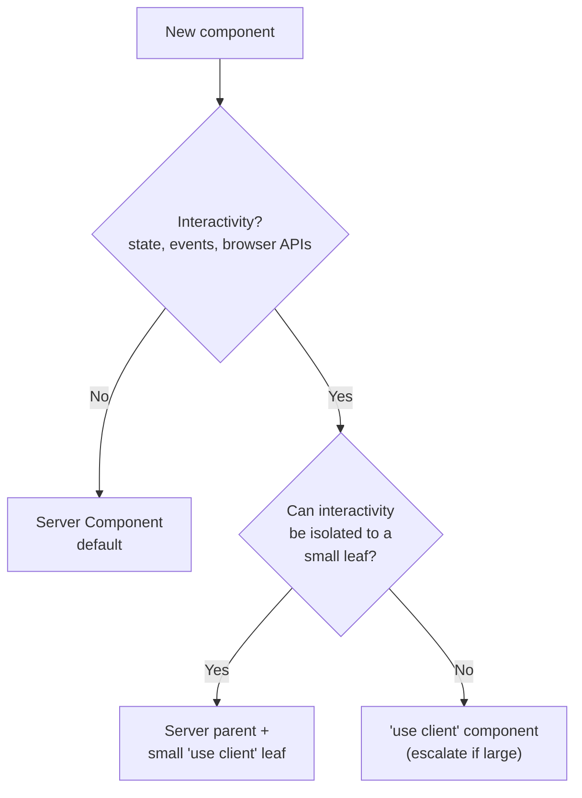
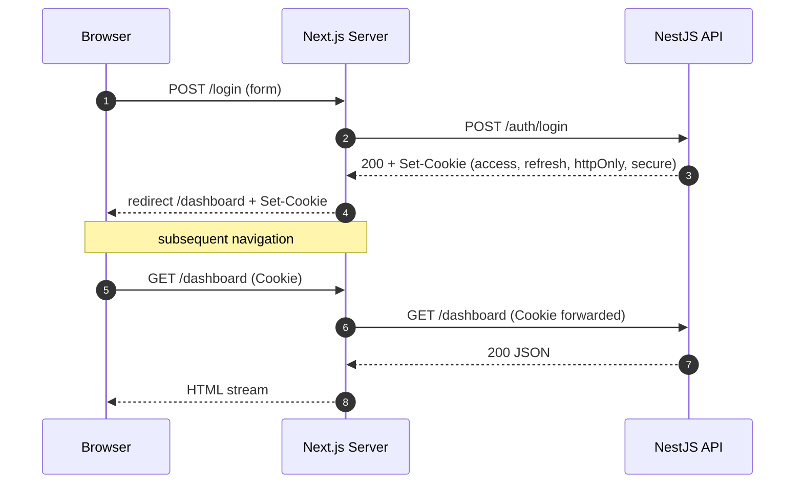
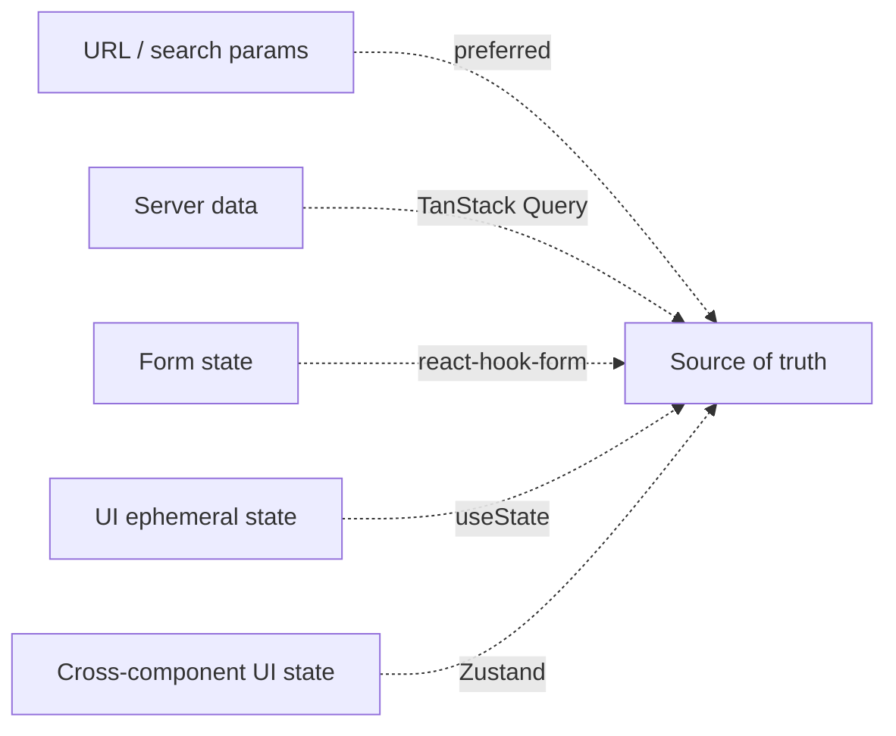

# Frontend Architecture (Next.js)

> **Maintainer:** Frontend Team
> **Last reviewed:** [DATE]
> **Status:** Living document

---

## 1. Goals

1. **Fast initial render** — LCP under 2.5s on 4G.
2. **Minimal client JS** — ship interaction, not framework.
3. **Type safety** — backend contracts flow into UI types automatically.
4. **DX > novelty** — boring, predictable patterns engineers can learn in a day.
5. **Accessible by default** — WCAG 2.1 AA for every component.

---

## 2. Stack

| Concern                | Choice                                                    |
| ---------------------- | --------------------------------------------------------- |
| Framework              | Next.js 14+ (App Router)                                  |
| Language               | TypeScript strict                                         |
| Styling                | Tailwind CSS + CSS variables for theming                  |
| Component primitives   | Radix UI (via shadcn/ui in `packages/ui/`)                |
| Forms                  | react-hook-form + Zod (`zodResolver`)                     |
| Data fetching (client) | TanStack Query                                            |
| State (server)         | RSC + cookies + cache                                     |
| State (client)         | Zustand for cross-component, `useState` for local         |
| HTTP client            | Generated from OpenAPI → typed `apiClient`                |
| Auth                   | HTTP-only cookies set by API; `getServerSession()` helper |
| Icons                  | lucide-react                                              |
| Animation              | framer-motion (sparingly)                                 |
| Testing                | Vitest (unit), Playwright (E2E), Storybook (visual)       |
| Bundle analysis        | `@next/bundle-analyzer` in CI                             |

---

## 3. Directory Structure

```
apps/web/
├── app/
│   ├── (marketing)/              # Public, static-friendly
│   │   ├── page.tsx
│   │   ├── pricing/
│   │   └── layout.tsx
│   │
│   ├── (auth)/                   # Login, signup, password reset
│   │   ├── login/
│   │   └── layout.tsx
│   │
│   ├── (app)/                    # Authenticated app shell
│   │   ├── layout.tsx            # Sidebar, header, auth check
│   │   ├── dashboard/
│   │   ├── settings/
│   │   └── ...
│   │
│   ├── api/                      # BFF routes (auth callbacks, webhooks proxy)
│   ├── error.tsx                 # Global error boundary
│   ├── not-found.tsx
│   ├── global-error.tsx
│   └── layout.tsx                # Root layout
│
├── components/
│   ├── ui/                       # Re-exports from @[project]/ui
│   ├── forms/                    # Form components
│   ├── features/                 # Feature-grouped (DashboardChart, BillingTable)
│   └── layout/
│
├── lib/
│   ├── api/                      # Typed API client (generated)
│   ├── auth/                     # Session helpers
│   ├── hooks/                    # Custom React hooks
│   ├── utils/                    # cn(), formatters
│   └── config.ts
│
├── styles/
│   └── globals.css
│
└── public/
```

### Route groups

- `(marketing)` — pre-rendered/static, no auth.
- `(auth)` — auth flow pages.
- `(app)` — requires session; layout enforces auth.

---

## 4. Server vs Client Components — Decision Rule

**Default to Server Components.** Add `'use client'` only when one of these is true:

1. The component uses `useState` / `useReducer` / `useEffect`.
2. The component uses event handlers (`onClick`, `onChange`).
3. The component uses browser-only APIs.
4. The component is below a 3rd-party client component that won't accept server children.



Push `'use client'` as far down the tree as possible. A large client component is a smell.

---

## 5. Data Fetching

### 5.1 Server Components — direct API call

```typescript
// app/(app)/dashboard/page.tsx
import { apiClient } from '@/lib/api';
import { getSession } from '@/lib/auth/server';

export default async function DashboardPage() {
  const session = await getSession();          // reads cookie
  const data = await apiClient.dashboard.get({ // typed, throws on !2xx
    token: session.accessToken,
    next: { revalidate: 30 },                  // ISR per-request
  });
  return <Dashboard data={data} />;
}
```

- Auth: cookie forwarded server-to-server, never exposed to the client.
- Caching: `next: { revalidate }` or `cache: 'no-store'` is **always explicit**.
- Errors thrown here bubble to `error.tsx` boundary.

### 5.2 Client Components — TanStack Query

```typescript
'use client';
const { data, isLoading } = useQuery({
  queryKey: ['transactions', { page }],
  queryFn: () => apiClient.transactions.list({ page }),
  staleTime: 30_000,
});
```

Wrap the app in `<QueryClientProvider>` once, in a small client component used by the root layout.

### 5.3 Mutations + cache invalidation

```typescript
const mutation = useMutation({
  mutationFn: apiClient.transactions.create,
  onSuccess: () => queryClient.invalidateQueries({ queryKey: ['transactions'] }),
});
```

For server-rendered pages that need to refresh after a mutation: `router.refresh()`.

---

## 6. Typed API Client

The backend publishes its OpenAPI spec to `packages/contracts/`. A script generates:

```
packages/contracts/
├── schemas/                  # Zod schemas (hand-authored, shared with BE)
├── generated/
│   └── api-client.ts         # Typed fetch wrappers
└── index.ts
```

Frontend imports:

```typescript
import { apiClient, UserSchema, type User } from '@[project]/contracts';
```

**Why this matters:** rename a field in the backend → frontend TypeScript fails in CI. No drift.

---

## 7. Forms

```typescript
'use client';
const form = useForm<CreateUserInput>({
  resolver: zodResolver(CreateUserSchema), // same schema BE uses
  defaultValues: { email: '', name: '' },
});

const onSubmit = form.handleSubmit(async (values) => {
  try {
    await apiClient.users.create(values);
    toast.success('User created');
  } catch (e) {
    if (isApiError(e, 'EMAIL_TAKEN')) {
      form.setError('email', { message: 'Email already in use' });
      return;
    }
    toast.error('Something went wrong');
  }
});
```

**Conventions:**

- Field-level errors → render under the field.
- Form-level errors → render in a banner at the top.
- Disable submit while in-flight; show spinner inline.
- Optimistic UI for non-critical mutations.

---

## 8. Auth on the Frontend



- Tokens **never** touch JavaScript.
- Server actions/route handlers proxy auth-cookie requests to the API.
- Refresh handled by a Next.js middleware on token expiry (silent rotation).

---

## 9. Performance Budget

| Metric                    | Budget                            | Enforcement                 |
| ------------------------- | --------------------------------- | --------------------------- |
| LCP (mobile, 4G)          | < 2.5s                            | Lighthouse CI gate          |
| TBT                       | < 200ms                           | Lighthouse CI gate          |
| CLS                       | < 0.1                             | Lighthouse CI gate          |
| First-load JS (per route) | < 200 KB gzipped                  | `next build` analyzer in CI |
| Image — all images        | `next/image`, responsive `sizes`  | ESLint rule + review        |
| Fonts                     | `next/font` only, `display: swap` | ESLint rule                 |

### Tactics

- **Streaming + Suspense** for slow data; never block the shell.
- **`<Link prefetch={true}>`** on visible nav links.
- **Dynamic import** for heavy client-only widgets (charts, editors).
- **Route segment config** — set `dynamic`, `revalidate`, `fetchCache` explicitly.

---

## 10. Accessibility

- Headings nest correctly (one `<h1>` per page).
- Every interactive element is keyboard-reachable + visible focus ring.
- `aria-label` on icon-only buttons.
- Color contrast ≥ 4.5:1 for text.
- Form fields paired with `<label>`.
- `eslint-plugin-jsx-a11y` enforced.
- Axe runs in Playwright E2E.

---

## 11. Styling

- Tailwind utility-first.
- Tokens (colors, spacing, radii) defined as CSS variables in `globals.css` for theming.
- Component variants via `cva` (class-variance-authority).
- No inline styles except for dynamic values (e.g., `style={{ width: pct + '%' }}`).
- Dark mode via `prefers-color-scheme` + manual override (cookie-backed).

---

## 12. State Management



**Decision order when choosing where state lives:**

1. Is it shareable / shareable URL? → URL search params.
2. Is it server data? → TanStack Query.
3. Is it form data? → react-hook-form.
4. Is it local UI? → `useState`.
5. Only if none of the above → Zustand store.

We don't add Redux. We don't add Jotai+Recoil+Zustand. Pick one for client state and stick with it.

---

## 13. Error Handling

| Layer                      | Handler                                                     |
| -------------------------- | ----------------------------------------------------------- |
| Per-route                  | `app/(group)/error.tsx`                                     |
| Per-segment async          | `<Suspense fallback>` + thrown errors caught by `error.tsx` |
| Global JS errors           | `global-error.tsx`                                          |
| Network errors (client)    | TanStack Query `onError` → toast + retry                    |
| API errors with known code | Mapped to user-friendly messages                            |

Always render something useful — never a white screen.

---

## 14. SEO

- `generateMetadata()` on every public page.
- Open Graph + Twitter cards via `metadata.openGraph`.
- Structured data (JSON-LD) for product pages.
- `sitemap.ts` + `robots.ts` at app root.
- No `noindex` on production routes unless intentional (auth pages excepted).

---

## 15. Testing

| Type   | Tool                           | What                                                  |
| ------ | ------------------------------ | ----------------------------------------------------- |
| Unit   | Vitest + React Testing Library | Components in isolation, hooks                        |
| Visual | Storybook                      | Every UI primitive + key compositions                 |
| E2E    | Playwright                     | Critical user journeys: signup, checkout, core action |
| A11y   | axe-playwright                 | On every E2E run                                      |

**Rule:** every critical journey has at least one E2E that runs on every PR.

---

## 16. Anti-Patterns We Reject

- ❌ Marking everything `'use client'` "to be safe."
- ❌ Calling the API from a client component when a server component would do.
- ❌ Storing auth tokens in `localStorage`.
- ❌ `useEffect` for data fetching (use Query or RSC).
- ❌ Custom CSS files per component. Tailwind or `cva`.
- ❌ `any` in props.
- ❌ Importing server-only modules into client components (Next will scream; respect it).

---

## 17. References

- [System Overview](./overview.md)
- [Backend Architecture](./backend.md)
- [Performance Playbook](../operations/performance.md)
- [Coding Standards](../conventions/coding-standards.md)
