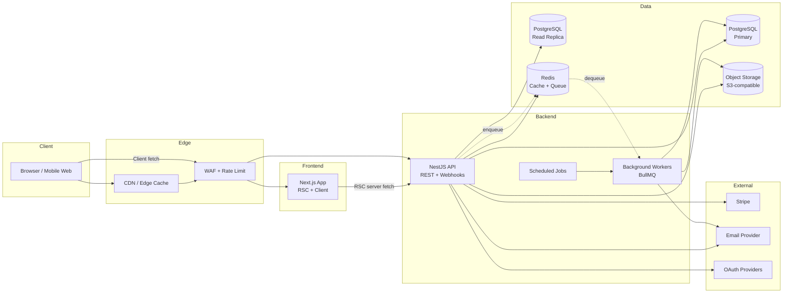
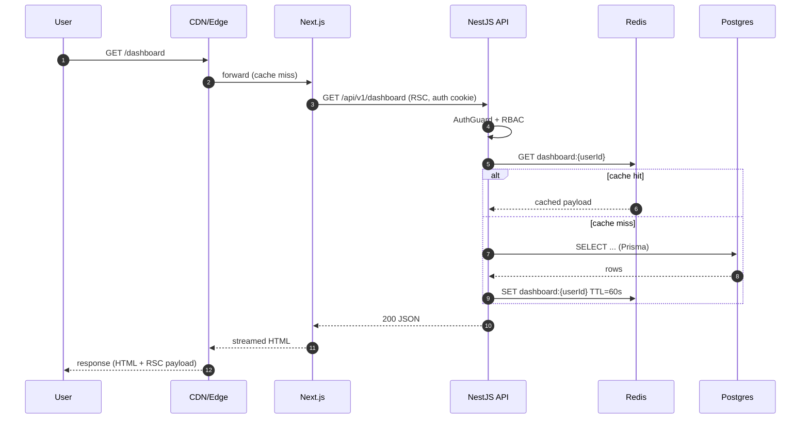
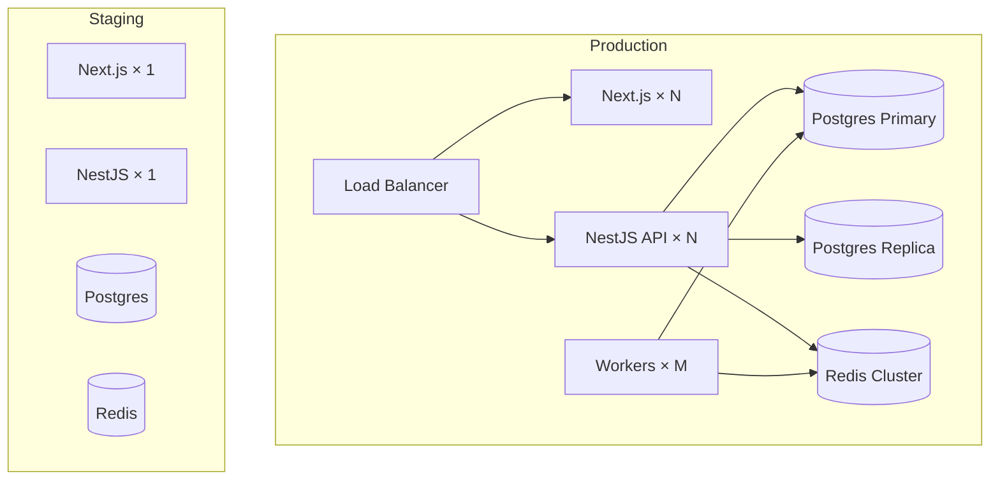

# System Architecture Overview

> **Maintainer:** Platform Team
> **Last reviewed:** [DATE]
> **Status:** Living document

---

## 1. Purpose

This document describes arcxde at the **system level**: components, boundaries, data flow, and the non-functional properties we optimize for. For implementation details, follow the links to backend, frontend, and database docs.

---

## 2. Architecture Style

arcxde is a **modular monolith** with clean module boundaries, designed to **extract into microservices** only when forced by scale or org structure — not before.

**Why a modular monolith first?**

- Single deployable unit → fast iteration.
- Refactor-friendly: cross-module changes are atomic.
- One database, transactional integrity by default.
- Microservice readiness: every module exposes a clear interface, no shared internals.

We graduate a module to a service only when:

- It has an independent scaling profile, **and**
- It is owned by an independent team, **and**
- The cost of in-process coupling > the cost of network + ops.

See [ADR-0002: Modular Monolith over Microservices](../adr/0002-modular-monolith.md).

---

## 3. High-Level Component Diagram

---

## 4. Component Responsibilities

### 4.1 Next.js (Web)

- Renders public marketing + authenticated app shell.
- **Server Components** for data-heavy pages (talk to API server-side with auth cookie).
- **Client Components** only where interactivity demands it.
- Edge-deployable. Static where possible, dynamic where required.
- See [Frontend Architecture](./frontend.md).

### 4.2 NestJS (API)

- Single source of business logic.
- Exposes REST endpoints under `/api/v1`.
- OpenAPI spec auto-generated from controllers (Swagger at `/docs`).
- Hosts webhook receivers (Stripe, etc.) under `/webhooks/*`.
- See [Backend Architecture](./backend.md).

### 4.3 Workers (BullMQ)

- Same NestJS codebase, different process (`--mode=worker`).
- Handles: email sends, report generation, third-party syncs, heavy computation.
- Idempotent jobs. Retries with exponential backoff. DLQ for poison messages.

### 4.4 PostgreSQL

- Primary write node. Read replica for analytics + heavy reads.
- Prisma manages schema and migrations.
- See [Database & Prisma](./database.md).

### 4.5 Redis

- Cache (response cache, computed values).
- Session store (if not pure JWT).
- BullMQ backing store.
- Rate-limit counters.

### 4.6 Object Storage (S3-compatible)

- User uploads, generated reports, backups.
- Pre-signed URLs only — never proxy through the API.

---

## 5. Request Lifecycle (happy path)

---

## 6. Non-Functional Requirements

| Property                       | Target        | Measurement                       |
| ------------------------------ | ------------- | --------------------------------- |
| Availability                   | 99.9% / month | Synthetic checks + uptime monitor |
| P50 API latency                | < 80ms        | OpenTelemetry, per-endpoint       |
| P95 API latency                | < 200ms       | OpenTelemetry, per-endpoint       |
| P99 API latency                | < 500ms       | OpenTelemetry, per-endpoint       |
| Web LCP                        | < 2.5s on 4G  | Lighthouse CI, RUM                |
| Web TBT                        | < 200ms       | Lighthouse CI                     |
| Recovery Time Objective (RTO)  | < 1 hour      | DR drill quarterly                |
| Recovery Point Objective (RPO) | < 5 minutes   | WAL-G continuous backup           |
| Error budget                   | 0.1% / month  | SLO dashboard                     |

See [Performance Playbook](../operations/performance.md) for tactics.

---

## 7. Cross-Cutting Concerns

### 7.1 Authentication & Authorization

- **AuthN:** JWT access token (15 min) + refresh token (rotating, 30 days). HTTP-only secure cookies for web; bearer header for non-browser clients.
- **AuthZ:** RBAC via NestJS Guards + a single `PermissionService`. Roles in DB, permissions derived.
- See [Security Architecture](./security.md).

### 7.2 Validation

- **Zod schemas in `packages/contracts/`** are the source of truth.
- Backend uses them via a `ZodValidationPipe`.
- Frontend uses them in forms (`react-hook-form` + `zodResolver`) and fetch wrappers.
- Generated TS types are exported from the same package.

### 7.3 Error Handling

- All errors flow through a global `HttpExceptionFilter` → returns the standard error envelope (see [API Design](../conventions/api-design.md#error-format)).
- All unhandled errors → Sentry with full context (user, request id, trace id).

### 7.4 Observability

- **Logs:** Pino, JSON, with `requestId` and `traceId` on every line.
- **Metrics:** Prometheus-compatible endpoint; key SLI metrics for every module.
- **Traces:** OpenTelemetry SDK; auto-instrumented HTTP, Prisma, Redis.
- See [Observability](./observability.md).

### 7.5 Idempotency

- All mutating public endpoints accept an `Idempotency-Key` header.
- Keys stored in Redis for 24h; identical request → identical response.

### 7.6 Rate Limiting

- Edge layer: WAF rules for absurd volumes.
- App layer: NestJS `@Throttle` decorator backed by Redis. Different buckets per endpoint class.

---

## 8. Deployment Topology

See [Deployment](../operations/deployment.md).

---

## 9. Future Considerations

| Topic                              | Trigger to revisit                                                 |
| ---------------------------------- | ------------------------------------------------------------------ |
| Extract billing into a service     | Billing logic > 20% of API codebase **or** independent team formed |
| GraphQL federation                 | Multiple frontends with divergent data needs                       |
| Event-driven backbone (Kafka/NATS) | Cross-system fan-out > 5 consumers                                 |
| Multi-region                       | Customer concentration outside primary region                      |
| Dedicated search service           | Postgres FTS hits limits on a critical surface                     |

---

## 10. References

- [ADR Index](../adr/README.md)
- [Backend Architecture](./backend.md)
- [Frontend Architecture](./frontend.md)
- [Database & Prisma](./database.md)
