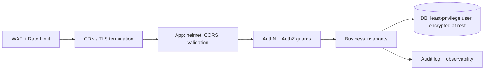

# Security Architecture

> **Maintainer:** Security / Platform
> **Last reviewed:** [DATE]
> **Status:** Living document

---

## 1. Threat Model (concise)

| Asset | Threats | Mitigations |
|---|---|---|
| User credentials | Phishing, brute force, leaks | Argon2id hashing, rate limits, MFA optional |
| Session tokens | XSS, CSRF, replay | HTTP-only secure cookies, short access TTL, rotating refresh, CSRF tokens on state-changing routes |
| PII | Unauthorized access, leaks | RBAC, field-level encryption for sensitive PII, audit logs |
| Money / billing | Replay, tampering | Idempotency keys, signed webhooks, server-side amount calculation only |
| Database | SQL injection, exfiltration | ORM-only (no raw concat), least-privilege DB user, network isolation |
| Secrets | Leakage to logs/repo | Secret manager, no `.env` in repo, log redaction |

---

## 2. Defense in Depth Layers



No single layer is trusted in isolation. Bypass one — others catch it.

---

## 3. Authentication

### 3.1 Passwords
- Hashing: **Argon2id**, params reviewed annually against OWASP guidance.
- Min length 12, no max upper bound. No forced character classes (NIST 800-63B).
- Breach check on signup + password change against HIBP k-anonymity API.

### 3.2 Tokens
- **Access token:** JWT, 15 minutes, signed with rotating asymmetric key (RS256).
- **Refresh token:** opaque, stored hashed in DB, 30 days, rotates on use.
- Cookies: `HttpOnly; Secure; SameSite=Lax; Path=/;` — `SameSite=Strict` on the refresh endpoint.

### 3.3 MFA
- TOTP (RFC 6238) — opt-in for users, required for admin roles.
- Backup codes one-time, hashed.

### 3.4 OAuth
- Standard providers (Google, Microsoft, GitHub) via OIDC.
- PKCE always. State parameter validated server-side.

---

## 4. Authorization

- **RBAC** with roles persisted in DB; permissions derived from role + resource.
- Single `PermissionService` — all checks go through it. No ad-hoc `if (user.role === 'admin')` scattered.
- **Resource-level checks** enforced in services, not controllers — a controller compromise still hits the wall.
- **Default deny** on new endpoints. Public endpoints opt in with `@Public()`.

---

## 5. Input Validation

- Every endpoint validates input with a Zod schema (see [Backend Architecture §6](./backend.md#6-validation-zod-pipe)).
- File uploads: type + size limits, virus scan if user-shared.
- IDs in path params validated against expected prefix (`usr_*`).

---

## 6. Output Encoding

- React escapes by default. **No `dangerouslySetInnerHTML`** except for sanitized rich text (DOMPurify).
- API responses are JSON — no HTML.
- Email templates use a templating engine with auto-escape.

---

## 7. CSRF

- All state-changing requests from browsers require a CSRF token (double-submit cookie pattern) **or** rely on `SameSite=Lax` plus pre-flighted CORS for cross-origin XHR. Pick one and document the trade-off in an ADR.
- Idempotent GETs never change state — enforced in code review.

---

## 8. CORS

- Allowlist of origins from config. No `*`.
- `credentials: true` only for known origins.
- Pre-flight cached for 1 hour.

---

## 9. Rate Limiting

| Endpoint class | Limit |
|---|---|
| Auth (login, signup, password reset) | 10 / 15 min / IP + 5 / 15 min / email |
| Read endpoints | 60 / minute / user |
| Write endpoints | 30 / minute / user |
| Webhooks | Per partner, signed + replay protected |

Implementation: Redis token bucket via NestJS Throttler. Returns `429` with `Retry-After`.

---

## 10. Secrets Management

- Production secrets in **AWS Secrets Manager** / **GCP Secret Manager** / **Vault** — pick per ADR.
- `.env` files **never committed**. `.env.example` is the contract.
- App reads secrets on boot through the config service.
- Rotation policy: keys ≤ 90 days, DB credentials ≤ 180 days.

---

## 11. Logging & Redaction

- A central `redact()` function strips `password`, `passwordHash`, `token`, `authorization`, `cookie`, `card.*` from any object before logging.
- Pino transport applies the redaction.
- Log review is part of weekly ops cadence.

---

## 12. Webhooks (Inbound)

- Verify HMAC signature with raw body **before parsing**.
- Replay protection: timestamp window 5 minutes + nonce tracked in Redis.
- Idempotency: every webhook produces effects exactly once.

---

## 13. Webhooks (Outbound)

- Signed with HMAC-SHA256 + timestamp header.
- Retries with exponential backoff up to 24h, then DLQ.
- Each customer can rotate their signing secret without downtime.

---

## 14. Database Security

- App uses a **least-privileged role** (no superuser, no DDL).
- DDL changes only via migration role used by CI deploy.
- Row-level security (RLS) considered for multi-tenant data — see ADR if enabled.
- Encryption at rest via the managed DB provider.
- Connections require TLS.

---

## 15. Network

- API behind a load balancer terminating TLS 1.2+ (1.3 preferred).
- DB and Redis on private subnets, no public ingress.
- Internal service calls via private DNS.

---

## 16. Headers (helmet defaults + overrides)

```typescript
app.use(helmet({
  contentSecurityPolicy: { /* explicit list, no 'unsafe-inline' in prod */ },
  hsts: { maxAge: 31536000, includeSubDomains: true, preload: true },
  referrerPolicy: { policy: 'strict-origin-when-cross-origin' },
}));
```

---

## 17. Dependency Hygiene

- `pnpm audit` on every CI run; high/critical block the build.
- Renovate / Dependabot weekly.
- Lockfile committed. Floating ranges only on `devDependencies`.

---

## 18. Incident Response

See [Incident Response Playbook](../confluence/incident-response.md). Security incidents are P1 regardless of customer impact.

---

## 19. References

- [Backend Architecture](./backend.md)
- [Observability](./observability.md)
- [Incident Response](../confluence/incident-response.md)
