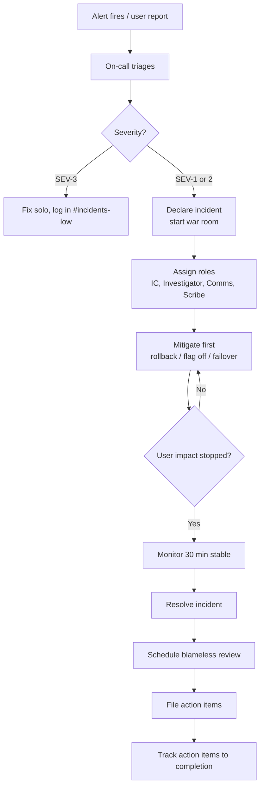

# Incident Response

**Owner:** SRE / On-call Lead
**Audience:** All engineers (especially on-call), support, leadership
**Status:** Living

> An incident is anything that breaks our promises to users — availability, latency, correctness, security, privacy. This document is the playbook for handling them: respond fast, communicate clearly, learn relentlessly, blame systems not people.

---

## 1. The five rules

1. **Stop the bleeding first, root-cause later.** Mitigation comes before understanding.
2. **Communicate often, even when there's nothing new.** "Still investigating" every 15 minutes beats radio silence.
3. **One Incident Commander at a time.** When in doubt, declare a commander, even if it's yourself.
4. **Blameless reviews.** People didn't fail; systems failed to make people's actions safe.
5. **The incident isn't over when the page resolves.** It's over when the review is written and the action items are filed.

---

## 2. Severity definitions

These match the alert routing in [monitoring.md](../operations/monitoring.md). They drive paging, comms, and post-incident review depth.

| Severity | Definition | Examples | Page? | Status page? | Review required? |
|---|---|---|---|---|---|
| **SEV-1** | Critical user impact OR data risk OR security event | Site down, payments broken, data corruption, credential leak, ransomware-style activity | Yes, immediate, escalate at 10 min | Yes, immediately | Yes, blameless review within 5 business days |
| **SEV-2** | Major degradation but core flows work | Latency 3× budget, one region unhealthy, key feature broken for a subset | Yes, non-urgent | Yes, within 30 min | Yes, lightweight review within 10 business days |
| **SEV-3** | Minor or contained | Background job delays without user impact, non-critical feature degraded | Slack only | Optional, only if customers noticing | Optional, judgment call |

**Security incidents are SEV-1 until proven otherwise.** Even a suspected breach gets SEV-1 treatment because the cost of underreacting outweighs the cost of overreacting.

---

## 3. Roles during an incident

For SEV-1 and substantial SEV-2 incidents, multiple roles need to exist. One person can hold multiple roles in small incidents; in large ones, split them.

| Role | Responsibilities |
|---|---|
| **Incident Commander (IC)** | Owns the incident response. Decides next moves. Does not do hands-on debugging — coordinates the people who do. Maintains the timeline. Calls in additional help when needed. |
| **Tech Lead / Investigator** | Does the actual debugging. Reports findings to the IC. May rotate as people get tired. |
| **Communications Lead** | Drafts status page updates and customer comms. Posts in `#incidents`. Filters noise so the IC and investigators can focus. |
| **Scribe** | Maintains the incident timeline in real time (when each event happened, what was tried, what the outcome was). Critical for the post-incident review. |

In smaller incidents, the on-call engineer wears all four hats. The moment that becomes too much to hold, escalate.

### How to declare yourself IC

> "I'm declaring myself IC for this incident. SEV-2. Status page going up. Need a second pair of eyes on the database."

That's it. The declaration is the act.

---

## 4. The incident response flow



---

## 5. Detection

How incidents get noticed, in order of preference:

1. **Synthetic probes** (see [monitoring.md](../operations/monitoring.md)) — they tell us before users do.
2. **Alerts on symptoms** — error rates, SLO burn, latency budgets exceeded.
3. **Customer reports through support** — escalation path: support → on-call within minutes for plausible SEV-1/2.
4. **An engineer notices on a dashboard** — happens, and it's fine.
5. **Social media / public complaints** — should be the channel of last resort. If users are tweeting before we paged ourselves, something's broken in detection.

---

## 6. The first 10 minutes

A rough script. Adapt to context.

### Minute 0–2: Triage

- Acknowledge the page.
- Quickly check: is this real, or is it the alert misfiring?
- Pull up the Service Overview dashboard.
- Look at recent deploys — anything land in the last hour?

### Minute 2–5: Decide

- What's the severity? (see table above)
- Who else do I need? Page the secondary, the service owner, security if relevant.
- Spin up the incident channel: `#incident-YYYY-MM-DD-short-description`.
- If SEV-1: status page placeholder up within 5 min. "We're investigating an issue affecting X. Updates in 15 min."

### Minute 5–10: Mitigate

- Can we revert the latest deploy? Do it.
- Can we flip the feature flag off? Do it.
- Can we failover to a healthy region / replica? Do it.
- Can we rate-limit / shed load to protect the rest of the system? Do it.

**Resist the urge to debug first.** A clean rollback gives you time and space to investigate without users suffering. The cost of an unnecessary revert is small; the cost of debugging for 40 minutes while users churn is large.

---

## 7. During the incident

### Communication cadence

- **Internal (incident channel):** real-time, anything worth noting.
- **Internal (`#incidents-broadcast` for visibility):** key state changes only ("declared," "mitigated," "resolved").
- **Status page:** every 15–30 minutes minimum during a SEV-1, even if just "no new info."
- **Customer email/in-product:** only for SEV-1s with material impact (>15 min of user-visible degradation). Drafted by Comms, reviewed by IC, approved by Product or Support lead.

### What to put in the status page

- What's broken (in user terms, not engineering jargon).
- What you're doing about it.
- ETA — only if you actually have one. "Investigating" is a fine update if it's true.
- No speculation about cause. Save that for the review.

### Avoiding the common traps

- ❌ Multiple people running independent debugging sessions. → IC coordinates, channels findings.
- ❌ "Just one more thing to try" pattern for 2 hours. → Set a 30-min timebox, then escalate or revert.
- ❌ Heroes refusing to hand off. → IC actively rotates tired humans out.
- ❌ Silent investigation. → "I'm checking X" in the channel, even if no findings yet.
- ❌ Touching prod with adrenaline. → All risky commands go in chat first, get a second pair of eyes before executing.

---

## 8. Mitigation playbook (common situations)

| Situation | First-line mitigation |
|---|---|
| Error rate spike right after deploy | Revert the deploy. Pipeline supports one-click rollback. |
| Error rate spike with no deploy | Check dependencies (DB, Redis, third-party APIs); check traffic anomalies. |
| Database connections exhausted | Restart pooler; identify and kill long-running queries; flag heaviest endpoints. |
| Queue backlog runaway | Scale out workers; if a poison message, move offending job to DLQ; pause queue if necessary. |
| Single region degraded | Failover traffic to healthy regions; investigate after. |
| Suspected credential leak | Rotate the credential immediately; revoke tokens; assess blast radius after. |
| Suspicious admin activity | Disable the account; preserve logs; loop in security; investigate after. |
| Payment provider issues | Switch to fallback provider if configured; queue + retry pattern handles transient failures. |

These all assume the runbooks exist. If a runbook is missing, the post-incident action item writes itself.

---

## 9. Resolution

An incident is **mitigated** when user impact stops. It is **resolved** when the system is back to normal _and_ has been stable for at least 30 minutes (longer for SEV-1).

When resolving:

- Post a final status page update.
- Note the resolution time in the incident channel.
- Schedule the review meeting before leaving the channel (otherwise it slips).
- Thank the people who helped. Genuinely.

---

## 10. Post-incident review (blameless)

The review happens within 5 business days of a SEV-1, 10 business days of a SEV-2.

### Format

60–90 minutes. Attendees: everyone who responded, the service owners, anyone with relevant context. Open to anyone in engineering who wants to learn.

### Template

```markdown
# Incident Review: [short description]

**Date of incident:** YYYY-MM-DD
**Severity:** SEV-1/2/3
**Duration:** Detected HH:MM → Mitigated HH:MM → Resolved HH:MM
**Authors:** @ic @investigator
**Status:** Draft / In Review / Final

## Summary
2–3 sentences. What happened, what was the impact, what fixed it.

## Impact
- Users affected: X% of total / specific cohort
- Requests affected: N over the incident window
- Revenue impact (if measurable): $X
- SLO impact: Y% of monthly error budget consumed

## Timeline
| Time (UTC) | Event |
|---|---|
| 14:02 | Alert: api_error_rate_high fired |
| 14:03 | @oncall acknowledged |
| 14:05 | Identified deploy at 13:58 as suspect |
| 14:07 | Initiated rollback |
| 14:11 | Rollback complete, error rate dropping |
| 14:25 | Error rate normal, incident mitigated |
| 14:55 | Resolved after 30 min stable |

## What went well
- Detection was fast (alert fired within 90s of regression)
- Rollback was clean and worked first try
- Status page updates were timely

## What went poorly
- The bug was caught by users before our pre-deploy canary spotted it
- Runbook for this service was outdated
- 4 people piled into the channel doing the same query, no IC was named for 12 minutes

## Where we got lucky
- The bug only affected a code path used by <5% of users; full impact would have been much higher
- The on-call engineer happened to be the same person who deployed the change

## Root cause(s)
Multiple. Not "who," but "what."
- Test coverage missed the failing case because [reason]
- The canary check didn't catch it because [reason]
- The runbook didn't help because [reason]

## Action items
| Action | Owner | Target date | Issue link |
|---|---|---|---|
| Add test case for the missed scenario | @author | YYYY-MM-DD | #1234 |
| Update canary check to include endpoint X | @platform-lead | YYYY-MM-DD | #1235 |
| Refresh runbook for service Y | @service-owner | YYYY-MM-DD | #1236 |
| Document IC-declaration protocol more prominently | @oncall-lead | YYYY-MM-DD | #1237 |
```

### "Blameless" — what it actually means

It does **not** mean "no individual is named in the document." Names are fine and necessary.

It does mean:

- We assume people acted reasonably given what they knew at the time.
- We ask "what made this action seem like the right one?" — not "why did you do this?"
- We focus action items on systems and processes, not on individuals being more careful.
- If the answer to "how do we prevent this" is "Sarah should be more careful," we haven't done the analysis yet.

If anyone is feeling personally targeted in a review, the facilitator stops the meeting and resets.

---

## 11. Action items: tracking and closing

Action items have a half-life. They lose value the longer they sit.

- Each action item has an owner and a target date at the time of the review. No exceptions.
- Engineering lead reviews open action items weekly.
- Action items overdue by > 30 days are escalated.
- We do not close an incident review until the **highest-priority** action items (the ones that would prevent recurrence) are done. Lower-priority polish items can ride along.

A pattern of slipping action items is itself a problem — surface it.

---

## 12. Special cases

### Security incidents

Detailed playbook in the security wiki. Key differences from operational incidents:

- Loop in security / legal immediately.
- Be extra careful with comms — premature disclosure can do more harm than the incident itself.
- Preserve evidence (logs, system state) before remediating where possible.
- External disclosure timing is a legal/regulatory question, not an engineering one.

### Data corruption / loss

- Stop all writes to the affected dataset before doing anything else.
- Identify what's recoverable from backups vs gone.
- Customer comms required, even if the data is recovered — trust is the thing being repaired, not just bytes.

### Third-party outages

When a dependency we rely on is down (payment provider, email provider, cloud region):

- We still own the user experience. "Our payment provider is down" is not a satisfying answer.
- Have a fallback or degraded mode where possible.
- Communicate to users in plain language ("payments are temporarily unavailable; we'll retry automatically"); don't hide behind the vendor name.

### Near-misses

Things that almost broke but didn't (caught by canary, caught in staging by accident, the bug was already fixed in a different PR). Worth a lightweight review — same template, less ceremony. The point is to learn from luck before luck runs out.

---

## 13. Practice: game days

Once a quarter, each service team runs a game day:

- Inject a deliberate failure in staging (kill a pod, drop a table column, fill a disk, expire a credential).
- On-call responds as if it were real.
- Time the response. Note what was missing (runbook? alert? access? muscle memory?).
- File issues for the gaps.

A team that hasn't done a game day in 6 months is overdue.

---

## 14. After-hours: what's expected

- On-call responds to SEV-1 pages 24/7. That's the deal.
- SEV-2 pages outside business hours are best-effort — handle if possible, defer to morning if not actively impacting users.
- Off-call engineers are not expected to jump in unless explicitly paged or volunteering.
- After a hard incident: take recovery time. A long late-night incident → late start next day or comp time. Manager handles this proactively.

---

## 15. Anti-patterns

- ❌ Treating the post-incident review as paperwork. It's the most valuable part.
- ❌ "Hero" engineers who refuse to hand off and burn out.
- ❌ Status page updates written like a marketing document. Users want truth, not spin.
- ❌ Closing an incident the moment the alert resolves, without monitoring or follow-up.
- ❌ Action items that say "be more careful" or "remember to check X." These don't change behavior at scale.
- ❌ Pretending a near-miss didn't happen because nobody noticed. We noticed.
