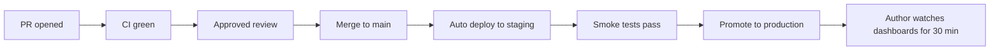
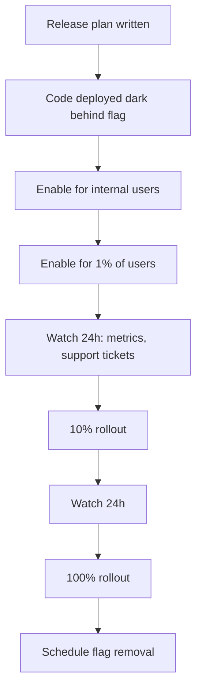

# Release Process

**Owner:** Platform / Release Captain
**Audience:** All engineers, product, support
**Status:** Living

> Releases should be boring. This document is the script for making them boring — predictable, low-risk, well-communicated, easy to roll back.

---

## 1. Release philosophy

1. **Continuous deployment is the default.** Every merge to `main` that passes CI goes to production. There is no "release day."
2. **Deploys are not releases.** Code can be deployed dark behind a feature flag for days or weeks before users see it. The two events are separated deliberately so that the technical risk (deploy) and the user-facing risk (release) can be managed independently.
3. **Small changes are safer than big ones.** Optimize for many small releases, not few big ones.
4. **Anyone can ship; everyone observes.** The author of a change watches it roll out. Authority and accountability stay together.
5. **Rollback over fix-forward.** When something looks wrong in production, the first instinct is revert; investigate after the bleeding stops.

---

## 2. Two kinds of releases

| Type                    | What                                                                                                             | How                                                         | Frequency                |
| ----------------------- | ---------------------------------------------------------------------------------------------------------------- | ----------------------------------------------------------- | ------------------------ |
| **Standard release**    | Merge to main → automated deploy through pipeline                                                                | Pipeline (see [deployment.md](../operations/deployment.md)) | Many per day             |
| **Coordinated release** | A user-visible change that crosses teams, requires marketing/support coordination, or has high reputational risk | Release captain orchestrates feature-flag rollout + comms   | When the work demands it |

Most things are standard releases. The bureaucracy below applies almost entirely to coordinated releases.

---

## 3. Standard release flow



### Author responsibilities

Before merging:

- All CI green (typecheck, lint, unit, integration, contract, audit, bundle size).
- At least one approving review.
- PR description explains _why_, not just _what_.
- If risky: feature flag is in place, default off.

After merging:

- Watch [Service Overview dashboard](../operations/monitoring.md) for ~30 minutes after the deploy hits production.
- Watch Sentry for new error fingerprints attributed to your commit.
- If anything looks off, revert. Investigate after.

### When CI is flaky

A flaky CI run is **not** a green light to merge. Either:

- Wait and re-run, or
- File the flake (see [testing.md](../conventions/testing.md) flake policy)

Bypassing CI is reserved for genuine emergencies and requires:

- Approval from on-call lead or engineering lead
- An issue filed for the bypassed check
- A note in the PR explaining the bypass

---

## 4. Coordinated release flow

For releases that cross team boundaries or have high external visibility:



### Release plan template

For any coordinated release, the release captain produces a short doc:

```markdown
# Release Plan: [Feature Name]

**Captain:** @username
**Target rollout date:** YYYY-MM-DD
**Feature flag:** flag.feature_name
**Stakeholders:** @eng-lead @product @support @marketing

## What ships

One paragraph. What changes from the user's perspective.

## Why now

Business / customer driver.

## Rollout plan

- [ ] Code deployed dark (date)
- [ ] Internal dogfooding (date)
- [ ] 1% rollout (date)
- [ ] 10% rollout (date)
- [ ] 100% rollout (date)
- [ ] Flag removal (date — 30 days after 100%)

## Risks & mitigations

| Risk                                              | Likelihood | Mitigation                                                  |
| ------------------------------------------------- | ---------- | ----------------------------------------------------------- |
| Example: payment provider rate limits us at scale | Medium     | Pre-warmed with provider; can fall back to v1 path via flag |

## Rollback plan

Disable flag.feature_name. Data effects (if any): describe how to clean up.

## Success metrics

What does "this release worked" look like? Tie to dashboards.

## Comms

- [ ] Internal announcement (date)
- [ ] Help-center article published (date)
- [ ] Customer email / in-product notice (date)
- [ ] Release notes entry (date)
```

The release captain owns the plan; everyone else executes their slice.

---

## 5. Feature flags

The detailed rules live in [coding-standards.md](../conventions/coding-standards.md) and [git-workflow.md](../conventions/git-workflow.md). The release-level rules:

- Every coordinated release rides a flag.
- Every flag has an owner and a remove-by date in its definition.
- Flags older than 90 days are auto-flagged in a weekly report and reviewed.
- Permanent flags (kill switches, regional toggles) are labeled `permanent: true` so they don't show up in the cleanup report.
- A flag at 100% rollout for 30 days is a candidate for removal; the captain files the cleanup PR.

---

## 6. Versioning

We use **semver** for the public API (`/api/v1`) and for any externally shipped artifacts (SDKs, CLIs, npm packages).

- **Major** (`1.0.0` → `2.0.0`): breaking change. New URL path (`/api/v2`). 6-month deprecation overlap minimum (see [ADR-0008](../adr/0008-api-versioning-uri.md)).
- **Minor** (`1.1.0` → `1.2.0`): backward-compatible feature.
- **Patch** (`1.1.0` → `1.1.1`): backward-compatible fix.

Internal services don't get version numbers — the deployed commit is the version. Every artifact in the registry is tagged with the git SHA and the build timestamp.

---

## 7. Release notes

Two audiences, two formats.

### Internal changelog

Auto-generated from Conventional Commits on merge to main. Filed in `CHANGELOG.md` per package and the top-level repo.

```
## 2026-05-11
### feat
- api: support cursor-based pagination on /organizations (#1234)
### fix
- web: prevent double-submit on signup form (#1239)
### perf
- api: eliminate N+1 in dashboard endpoint (#1241)
```

### Customer release notes

Hand-written, published to the help center. Aimed at users, not engineers.

- Lead with what they can do that they couldn't before.
- Drop the implementation detail; keep the user impact.
- Include screenshots/GIFs where relevant.
- Group by area, not by chronological order of merges.

Cadence: weekly digest, plus immediate post for major launches.

---

## 8. Hotfix process

Hotfixes apply to production-impacting bugs that can't wait for the normal merge-to-main flow. The detailed branch flow is in [git-workflow.md](../conventions/git-workflow.md).

The release-process view:

1. Confirm severity. If it's a P1 incident, follow [incident-response.md](./incident-response.md) — hotfix is one possible mitigation, not the only one.
2. Branch from the production-deployed SHA (not main, in case main has unshipped changes).
3. Minimal, focused fix. Resist scope creep.
4. Same CI gates; reduced review threshold (one reviewer instead of the usual minimum) is acceptable if time-critical.
5. Deploy via the same pipeline. There is no separate "emergency deploy" mechanism — building one creates bypass risk.
6. Forward-port the fix to main if main has diverged.
7. Write the post-incident review.

---

## 9. Release windows

There are no formal release windows for standard releases — that's the point of continuous deployment.

For coordinated releases:

- **Preferred:** Tuesday – Thursday, 09:00–16:00 local.
- **Avoid:** Friday after 14:00, weekends, the day before a holiday, the day before a major customer-facing event.
- **Forbidden without explicit lead approval:** during a declared incident, during a known dependency outage.

These are guidelines for releases, not for deploys. Deploying a bug fix on a Friday afternoon is fine. Launching a new product to all customers on a Friday afternoon is not.

---

## 10. Release captain rotation

For teams or products with frequent coordinated releases, we run a release captain rotation:

- One captain per week, per release-heavy team.
- Captain's responsibilities:
  - Triages flag rollouts in flight
  - Authors / reviews release plans
  - Owns the weekly customer release-notes digest
  - First point of contact for "is now a good time to launch X?"
- Captain is _not_ on-call by default; the roles can stack but don't have to.

Smaller teams without enough release volume to justify a rotation: the relevant tech lead acts as captain ad hoc.

---

## 11. Database migrations during release

The mechanics live in [database.md](../architecture/database.md). The release-level view:

- Migrations run **before** the application code that depends on them.
- Migrations must be backward-compatible with the previous deployed code so that a partial rollout doesn't break the old instances still running.
- The "expand / migrate data / contract" pattern is the default for any schema change beyond a pure addition.
- Renames and column drops are always two-release operations — never combined.
- Long-running migrations (taking > 30s) go through a separate channel: announced in advance, often run off-hours, monitored.

---

## 12. External communication

Who tells whom, what:

| Event                                  | Channel                                                                                         | Owner               | When                                            |
| -------------------------------------- | ----------------------------------------------------------------------------------------------- | ------------------- | ----------------------------------------------- |
| Coordinated release at 100%            | Customer email + in-product banner + release notes                                              | Product + Marketing | Day of                                          |
| New major API version                  | Developer changelog + email to API users                                                        | Platform            | Day of, plus deprecation notices on old version |
| Breaking change to existing API        | Email to affected customers + in-product notice + log warning header on the deprecated endpoint | Platform + Support  | At least 6 months in advance                    |
| Planned maintenance                    | Status page + email to admins                                                                   | Platform            | At least 1 week in advance                      |
| Hotfix that fixes a user-impacting bug | Status page entry, no email unless reportable incident                                          | On-call / Support   | Same day                                        |

Support team always gets a heads-up _before_ the customer-facing announcement, never after. Surprised support = bad day for everyone.

---

## 13. Anti-patterns

- ❌ Batching unrelated changes into a "release" to reduce overhead. The overhead is the symptom; fix the pipeline.
- ❌ "Code freeze" before launches. If the system needs a freeze to be stable, the system is the bug.
- ❌ Releasing a feature without the dashboards to know if it's working.
- ❌ Removing a feature flag before the rollout has been stable at 100% for 30 days.
- ❌ Treating the release notes as a marketing document. Users want to know what changed, not how excited we are.
- ❌ Skipping the post-launch dashboard watch because "it's just a small change."
