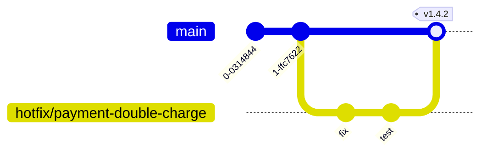

# Git Workflow

> **Maintainer:** All engineers
> **Last reviewed:** [DATE]

We use **trunk-based development** with short-lived feature branches. The goal is rapid integration and minimal merge pain.

---

## 1. Branches

- `main` — always deployable. Auto-deploys to `staging`. Protected.
- `release/*` — used only if a release needs to be cut at a specific commit while `main` moves forward. Rare.
- Feature branches:
  - `feat/<area>-<short-name>` — new feature
  - `fix/<area>-<short-name>` — bug fix
  - `chore/<short-name>` — non-product work
  - `refactor/<area>-<short-name>` — internal cleanup
  - `docs/<short-name>` — docs only

Branches live **days, not weeks**. If yours has lived a week, rebase and consider splitting.

---

## 2. Commits

Use **Conventional Commits**, enforced by commitlint.

```
<type>(<scope>): <short summary>

<body — what and why, not how>

<footer — issue refs, breaking changes>
```

Types: `feat`, `fix`, `chore`, `refactor`, `perf`, `docs`, `test`, `build`, `ci`, `revert`.

Examples:

```
feat(billing): add support for ACH payments
fix(auth): refresh token rotation race
docs(architecture): clarify worker process scope
refactor(users): extract repository layer
```

**Breaking changes** include a `BREAKING CHANGE:` footer with migration notes.

---

## 3. Pull requests

### Title

Same format as the commit title. PRs are squash-merged; the PR title becomes the merge commit.

### Description

The PR template covers:

- **What** changed
- **Why** (link the issue)
- **How to verify** (steps, screenshots, recordings)
- **Risk** assessment
- **Migration** notes if applicable
- **Checklist** (tests, docs, ADR if needed)

### Size

Aim for < 400 lines changed. Larger PRs are reviewed slower and worse. Split:

- Mechanical refactors first
- Add tests for old behavior
- Then make the substantive change

### Reviewers

- At least **one approval** required. Two for changes touching auth, billing, or DB schema.
- Code owners auto-assigned via `CODEOWNERS`.
- Use "Request changes" for must-fix; "Comment" for non-blocking suggestions. Be specific in nits — call them `nit:` so the author can skip if needed.

---

## 4. CI gates

PRs cannot merge unless:

- TypeScript builds cleanly
- ESLint passes with zero warnings
- Tests pass (unit + integration; E2E on critical paths)
- Coverage thresholds met
- No high/critical `pnpm audit` findings
- Bundle size (web) within budget
- Prisma migration diff reviewed (label `migration:reviewed`)

---

## 5. Merge strategy

- **Squash and merge** is the default.
- The squashed commit title is the PR title (Conventional Commit format).
- `main` history is therefore: one commit per PR. Clean, linear, blameable.

Rebase merges are allowed for PRs where individual commits tell a meaningful story (rare). Merge commits are not allowed.

---

## 6. Hotfix flow

Production bug, can't wait for the queue:



1. Branch from `main` (or the deployed tag): `fix/<critical-thing>`.
2. PR with `hotfix` label — gets accelerated review.
3. Merge to `main`.
4. Cherry-pick to any release branches if applicable.
5. Tag and deploy.

---

## 7. Tagging & releases

- Tags: `v<major>.<minor>.<patch>` (SemVer).
- Tag on `main` for every production release.
- Release notes auto-generated from Conventional Commits since the previous tag.
- Pre-releases: `v1.5.0-rc.1`.

---

## 8. Reverts

If a PR breaks production:

- **Revert first, debug later.** Don't try to roll-forward under pressure.
- Use GitHub's "Revert" button — it preserves history.
- Open a follow-up PR with the proper fix.

---

## 9. Long-running work

Use **feature flags**, not long-lived branches. Ship code behind a flag, enable later.

- Flags are simple: boolean per environment, configurable per-user/org at runtime if needed.
- Flags are documented and have an owner.
- Flags are temporary — every flag has a "remove by" date. Quarterly cleanup.

---

## 10. Things we don't do

- ❌ Force-push to `main` or any shared branch.
- ❌ Merge with red CI (no "approve anyway" without tech lead).
- ❌ Commit secrets. Use the secret manager.
- ❌ Commit large binaries. Use object storage; document in README if needed.
- ❌ Mix unrelated changes in one PR.
- ❌ Leave PRs open for weeks. Close or merge.

---

## 11. Pre-commit hooks

Husky + lint-staged:

- Prettier on changed files
- ESLint --fix on changed files
- Typecheck on changed packages

Pre-push:

- Full typecheck
- Affected unit tests

To skip in emergencies: `git commit --no-verify`. Use sparingly and tell the team why.

---

## 12. References

- [Conventional Commits](https://www.conventionalcommits.org/)
- [Trunk-based development](https://trunkbaseddevelopment.com/)
- [Coding Standards](./coding-standards.md)
