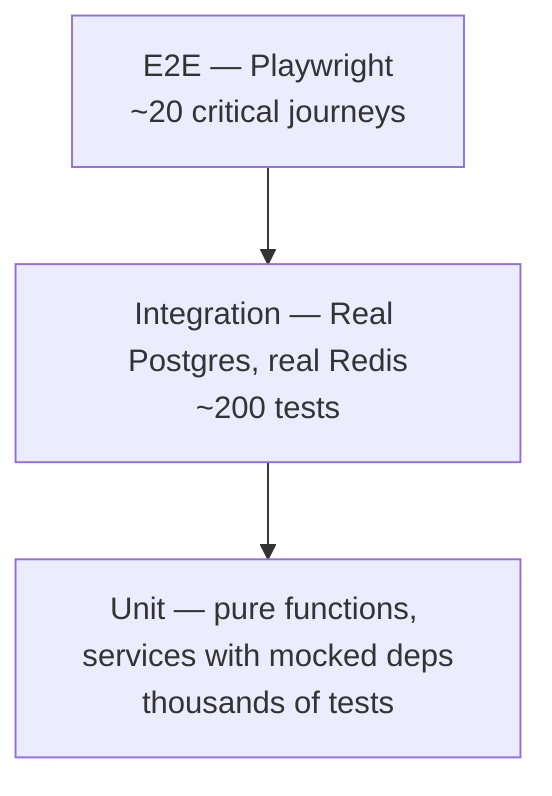

# Testing Strategy

> **Maintainer:** All engineers
> **Last reviewed:** [DATE]

Tests are not a separate phase — they are part of the feature. A PR without tests is incomplete.

---

## 1. Philosophy

1. **Test behavior, not implementation.** A refactor shouldn't break tests if behavior didn't change.
2. **Fast feedback wins.** Unit tests sub-second; full suite minutes; E2E rare and targeted.
3. **Real over mocked, where it's cheap.** Testcontainers boots Postgres in seconds. Use it.
4. **Coverage is a hygiene check, not a goal.** 100% coverage with bad assertions is worse than 80% with sharp ones.

---

## 2. The pyramid (our version)



- **Unit (≥ 80%):** services, utilities, hooks. Mock external boundaries only.
- **Integration (~15%):** API + DB + cache. Real Postgres via Testcontainers, real Redis, mocked outbound HTTP.
- **E2E (~5%):** Playwright on critical paths only — signup, login, core action, checkout.

---

## 3. Tools

| Type                  | Tool                              | Notes                                          |
| --------------------- | --------------------------------- | ---------------------------------------------- |
| Unit (backend)        | Vitest                            | Fast, ESM-native                               |
| Integration (backend) | Jest + Supertest + Testcontainers | Booted Postgres + Redis                        |
| Unit (frontend)       | Vitest + React Testing Library    | RTL, no Enzyme                                 |
| Visual                | Storybook + Chromatic (optional)  | UI primitives                                  |
| E2E                   | Playwright                        | Headless in CI, headed locally                 |
| Accessibility         | axe-playwright                    | Runs inside E2E                                |
| Load                  | k6                                | Pre-launch + before significant traffic events |
| Contract              | OpenAPI diff in CI                | Detect breaking changes                        |

---

## 4. File layout

```
foo.service.ts
foo.service.spec.ts          # Unit
foo.controller.ts
foo.controller.e2e-spec.ts   # API-level integration (in apps/api/test/)
```

E2E tests live in `apps/web/e2e/` and `apps/api/test/e2e/`.

---

## 5. Unit test conventions

```typescript
describe('BillingService.charge', () => {
  it('charges the customer and records a ledger entry on success', async () => {
    // Arrange
    const stripe = mock<StripeService>();
    stripe.charge.mockResolvedValue({ id: 'ch_1', status: 'succeeded' });
    const sut = new BillingService(prismaMock, stripe, eventsMock, loggerMock);

    // Act
    const result = await sut.charge({ customerId: 'usr_x', amountCents: 1000 });

    // Assert
    expect(result.status).toBe('SUCCESS');
    expect(stripe.charge).toHaveBeenCalledOnce();
    expect(prismaMock.ledgerEntry.create).toHaveBeenCalledWith(/* ... */);
  });

  it('raises CardDeclinedError when Stripe returns card_declined', async () => {
    /* ... */
  });
});
```

- One behavior per test.
- Title is a sentence.
- AAA blocks visible.
- Don't assert on log calls unless logging _is_ the behavior.

---

## 6. Integration test conventions

```typescript
let app: INestApplication;
let prisma: PrismaService;

beforeAll(async () => {
  await startPostgresContainer();
  await startRedisContainer();
  app = await buildApp({ database: { url: pgContainer.url } });
  prisma = app.get(PrismaService);
});

beforeEach(async () => {
  await prisma.$executeRaw`TRUNCATE TABLE ... CASCADE`;
});
```

- Real DB, real Redis. Schemas migrated once per suite, truncated between tests.
- Use Supertest for HTTP-level assertions.
- Test the **public contract** of the module — controllers in, side effects out.

---

## 7. E2E conventions

Treat E2E as expensive. Each test should justify itself.

```typescript
test('a new user can sign up, verify email, and reach the dashboard', async ({ page }) => {
  await page.goto('/signup');
  await page.getByLabel('Email').fill(uniqueEmail());
  await page.getByLabel('Password').fill('Correct-Horse-Battery-9');
  await page.getByRole('button', { name: 'Create account' }).click();
  // ...
  await expect(page).toHaveURL(/\/dashboard/);
});
```

- Test against a staging-equivalent environment.
- Each test creates its own data — no shared fixtures.
- Use accessible selectors (`getByRole`, `getByLabel`) — they break less and double as a11y checks.
- Network mocking only for third-party services we can't hit in test.

---

## 8. Mocks — when and when not

Mock:

- External SaaS we don't own (Stripe, email, OAuth providers).
- Time (`vi.useFakeTimers()`).
- Random values (`Math.random`, `crypto.randomUUID`) — inject via a service.

Don't mock:

- Code you own. If it's hard to test without mocking it, the design is the problem.
- Prisma. Use a real DB.
- HTTP between your own services. Boot them.

---

## 9. Test data

- **Builders / factories** for entities — no copy-paste object literals across tests.
  ```typescript
  const user = aUser().withEmail('alice@example.com').build();
  ```
- Builders live next to the model they build.
- Seed data is **never** shared between tests. Each test sets up what it needs.

---

## 10. Coverage

| Surface            | Lines | Branches |
| ------------------ | ----- | -------- |
| Services (backend) | 90%   | 85%      |
| Utilities          | 95%   | 90%      |
| Controllers        | 70%   | 60%      |
| UI components      | 70%   | 60%      |
| Overall repo       | 80%   | 75%      |

Enforced in CI. PR that drops coverage below threshold fails.

Coverage is reported but **not the goal**. Reviewers focus on whether the tests assert meaningful behavior.

---

## 11. Flaky tests

- A flaky test is a **bug**, not a feature of the suite.
- Quarantine policy: a test that fails intermittently is `.skip`-ped within 24 hours and tracked by an issue with a fix deadline (≤ 1 week).
- No test stays quarantined longer than two weeks. Fix or delete.

---

## 12. Performance tests

For revenue or scale-critical endpoints:

- k6 script in `/performance/`.
- Run before launch and before any 10x traffic event.
- Target: P95 stays within budget at 2× expected peak.

---

## 13. Contract tests

OpenAPI spec is committed. CI diffs the generated spec against the committed one — any change requires the PR to explicitly bump the spec. A breaking diff requires a versioning ADR.

---

## 14. CI orchestration

- Tests run in parallel by package.
- Turbo cache keyed on inputs — unchanged packages are skipped.
- E2E runs only on PRs that touch web or affected API modules.
- Full E2E suite runs on `main` post-merge.

---

## 15. Local commands

```bash
pnpm test                    # All unit tests
pnpm test --watch            # Watch mode (TDD-friendly)
pnpm test:integration        # Integration suite (boots containers)
pnpm test:e2e                # Playwright
pnpm test:e2e --ui           # Playwright UI mode (debug)
pnpm test:coverage           # Coverage report
```

---

## 16. References

- [Coding Standards](./coding-standards.md)
- [Backend Architecture](../architecture/backend.md)
- [Frontend Architecture](../architecture/frontend.md)
