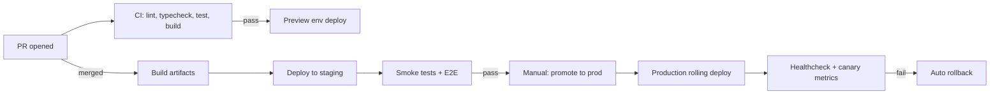
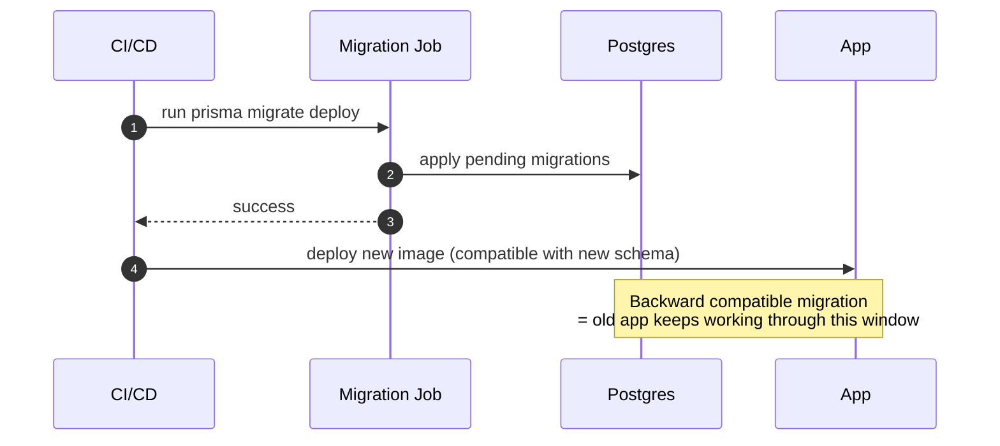

# Deployment

> **Maintainer:** Platform Team
> **Last reviewed:** [DATE]

---

## 1. Environments

| Environment  | Branch / Trigger             | Purpose                                        | URL                     |
| ------------ | ---------------------------- | ---------------------------------------------- | ----------------------- |
| `local`      | developer machine            | Daily development                              | http://localhost:3000   |
| `preview`    | every PR                     | Per-PR ephemeral environment                   | `pr-<n>.<project>.dev`  |
| `staging`    | merge to `main`              | Pre-prod verification, mirrors prod data shape | `staging.<project>.com` |
| `production` | manual promotion from `main` | Live customer traffic                          | `<project>.com`         |

Production deploys are **gated by a human** — we don't auto-deploy from `main` to production. Staging is the verification layer.

---

## 2. Pipelines



---

## 3. Build artifacts

We build **once**, deploy the same artifact across environments. No re-builds per environment.

- API: Docker image, tagged `api:<git-sha>`, pushed to the registry.
- Web: Next.js standalone output, also bundled into a Docker image `web:<git-sha>`.
- Migrations: SQL files, applied by a separate one-shot job, not by app boot.

---

## 4. Configuration per environment

- Same artifact, different env vars.
- Env vars come from the secret manager at boot, not from `.env` files in the image.
- Config schema (Zod) validates on boot — missing/invalid values **crash early**.

---

## 5. Release strategy

### API: rolling deploy

- N+1 instances brought up with the new image.
- New instances must pass `/ready` for 30s before old instances are terminated.
- Backward-compatible migrations always — see [Database §6](../architecture/database.md#6-migrations).

### Web: blue/green at the edge

- New Next.js bundle deployed alongside old.
- Edge router cuts traffic over atomically.
- Old bundle retained for ≥ 1 hour to support instant rollback.

### Canary (optional, for risky changes)

- 5% of traffic to the new version for 30 minutes.
- Auto-rollback if error rate or P95 latency exceeds threshold.

---

## 6. Database migrations



Rules:

- Migrations run **before** the new app version rolls out.
- Migrations must be backward compatible with the _previous_ app version (zero downtime).
- Destructive changes ship in **two deploys**: stop using → drop.

---

## 7. Rollback

Tier 1: **fast** — switch traffic back to the previous Docker image / Next bundle. Always available, < 60 seconds. Practiced in drills.

Tier 2: **migration rollback** — only when forward fix would take longer. Has its own runbook because:

- Down-migrations are not auto-generated by Prisma. Each migration ships with a reviewed down-script if the change is destructive.
- We may accept the migration stays and write a forward fix instead.

---

## 8. Secrets

- Production secrets live in the cloud secret manager.
- Apps read them at boot through the typed config.
- Rotation:
  - JWT signing keys: every 90 days, with overlap window.
  - DB credentials: every 180 days.
  - Third-party API keys: per provider policy, minimum yearly.
- Access to production secrets is logged. Engineer access requires break-glass approval.

---

## 9. Infrastructure as code

- All cloud resources managed by Terraform (or Pulumi).
- Manual changes in the console are forbidden in staging and production.
- Drift detection runs nightly; alerts on diff.

---

## 10. Container runtime

- Single non-root user inside the image (`USER node`).
- Read-only root filesystem; writable volume mounts only where needed.
- Resource limits set (CPU, memory) — we want OOMs to be loud, not silent perf cliffs.
- Health probes: `/health` (liveness), `/ready` (readiness), separate ports for `/metrics`.

---

## 11. Graceful shutdown

```typescript
// API
const app = await NestFactory.create(AppModule);
app.enableShutdownHooks(); // run onModuleDestroy
process.on('SIGTERM', async () => {
  await app.close(); // drain HTTP, close Prisma, finish queue jobs in flight
  process.exit(0);
});
```

- Drain timeout: 30s. Long-running requests fail fast after that.
- Workers stop accepting new jobs, finish current, then exit.

---

## 12. Backups

- Daily logical backups (`pg_dump`) retained 30 days.
- Continuous WAL archiving → PITR with 5-minute RPO.
- Backups stored in a separate cloud account with no write access from prod.
- Quarterly restore drill. Tested = trusted.

---

## 13. Disaster recovery

| Failure             | Strategy                           | Target                    |
| ------------------- | ---------------------------------- | ------------------------- |
| Single app instance | Health check, restart, replace     | < 1 min                   |
| Availability zone   | Multi-AZ deployment, auto-failover | < 5 min                   |
| Database primary    | Promote replica                    | RTO < 15 min, RPO < 5 min |
| Full region         | Restore from cross-region backup   | RTO < 4 hours             |
| Code regression     | Rollback artifact                  | RTO < 1 min               |

DR plan rehearsed quarterly — partial scenario each quarter, full restore annually.

---

## 14. Deploy windows

- Deploys allowed: Tuesday–Thursday, 09:00–16:00 local team time.
- No deploys: Friday after 13:00, weekends, holidays — except hotfixes with on-call sign-off.
- Customer-facing maintenance windows announced 72h ahead.

---

## 15. References

- [System Overview](../architecture/overview.md)
- [Database & Prisma](../architecture/database.md#6-migrations)
- [Incident Response](../confluence/incident-response.md)
